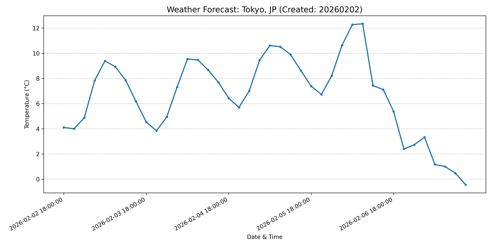

# Project-ADVANCE-2026：AWSコスト監視システム（JPY換算版）

## 📌 プロジェクトの概要
このプロジェクトは、AWS（Amazon Web Services）の利用料金を自動的に取得し、日本円（JPY）に換算して表示するツールです。
「クラウドエンジニアとしての第一歩」として、AWSの権限管理（IAM）とプログラム（Python）の連携を実戦形式で構築しました。

## 🏗️ システム構成図
本プロジェクトでは、セキュリティを最優先に考え、人間とロボットの権限を分離しています。

- **司令部 (Local PC)**: `naru-admin` (IAMユーザー) の鍵を使い、コストを取得・確認。
- **保管庫 (GitHub)**: ソースコードの管理。
- **配送ロボ (GitHub Actions)**: `github-s3-deployer` (IAMユーザー) が S3 バケットへ自動同期。

## 🛡️ セキュリティと防諜
- **最小権限の原則**: 配送ロボにはS3の操作権限のみを付与し、基地全体の安全を確保。
- **機密情報の保護**: `.gitignore` を活用し、AWSの合鍵（Access Keys）が外部に流出しないよう徹底。

## 🚀 主な機能
- `get_cost.py`: 昨日のAWS利用料金をドルで取得し、指定レートで日本円に変換して表示。
- `check_aws.py`: 接続テスト用。現在のアカウントIDとUserIdを表示し、正常な通信を確認。

## 💻 使用技術
- **Language**: Python 3.x
- **Library**: Boto3 (AWS SDK for Python)
- **Cloud**: AWS (Cost Explorer, S3, IAM)
- **CI/CD**: GitHub Actions

# Project-ADVANCE-2026
## Integrating IT into Daily Life for Strategic Growth / ITを日常に組み込み活用していく道

---

## 📌 Table of Contents / 目次
- [Project Overview / プロジェクトの概要](#-project-overview--プロジェクトの概要)
- [5-Day Weather Forecast Automation / 5日間天気予報の自動取得と可視化](#-5-day-weather-forecast-automation--5日間天気予報の自動取得と可視化)
    - [Features / 実装済み機能](#-features--実装済み機能)
    - [Report Example / 生成レポートの例](#-report-example--生成レポートの例)
    - [Career Connection / キャリアへの繋がり](#-career-connection--キャリアへの繋がり)

---

## 📌 Project Overview / プロジェクトの概要

### Foundational Goals / 基礎構築
- **AWS Certification**: Obtaining AWS Certified Cloud Practitioner (CLF).
  - AWS 認定資格（CLF）の取得。
- **Practical Experience**: Accumulating hands-on technical skills.
  - 実務経験の蓄積。
- **Knowledge Sharing**: Technical blogging and output via GitHub/note.
  - 技術ブログやGitHubによるアウトプット。

### Experiments & Systems / 実験と仕組み化
- **Automation**: Developing YouTube automation systems using Python.
  - Python による YouTube 全自動収益工場の構築。
- **FinOps**: Serverless (AWS Lambda) cost optimization and automation.
  - サーバーレス（AWS Lambda）を活用したコスト最適化の自動運用。

---

## 🛠 5-Day Weather Forecast Automation / 5日間天気予報の自動取得と可視化

Developed a professional-grade automation tool that retrieves external API data and generates visual reports (graphs).
Pythonを用いて外部APIから情報を取得し、実務で活用できるレベルのレポート（グラフ）を自動生成するツールを開発しました。

### 🔹 Features / 実装済み機能
- **API Integration**: Fetches 5-day (3-hour interval) data via OpenWeatherMap API.
  - **API連携**: OpenWeatherMap APIから5日間（3時間おき）の気象データを取得。
- **Data Extraction**: Accurate parsing of nested JSON structures (DateTime & Temperature).
  - **データ抽出**: 複雑なJSON構造から必要な「日時」と「気温」を正確に抽出。
- **Data Visualization**: Enhanced readability by sampling data at 24-hour intervals (8-step hack).
  - **可視化（データ・ハック）**: 40個のデータをそのまま並べず、24時間周期（8ステップ）で目盛りを間引くことで視認性を向上。
- **Dynamic File Management**: Automated time-stamped file naming using the `datetime` module.
  - **動的ファイル管理**: `datetime`モジュールを使用し、実行時の日付をファイル名に自動刻印して保存。

### 📊 Report Example / 生成レポートの例

### 💡 Career Connection / キャリアへの繋がり
Through this project, I mastered the fundamental cycle of **"Data Retrieval → Analysis (JSON) → Decision-support Visualization."** This process is essential for AWS cost optimization and FinOps analysis.
このプロジェクトを通じて、**「外部データの取得 → 構造の解析(JSON) → 意思決定のための可視化」** という、FinOpsやAWSエンジニアに必須のデータ処理サイクルを習得しました。
